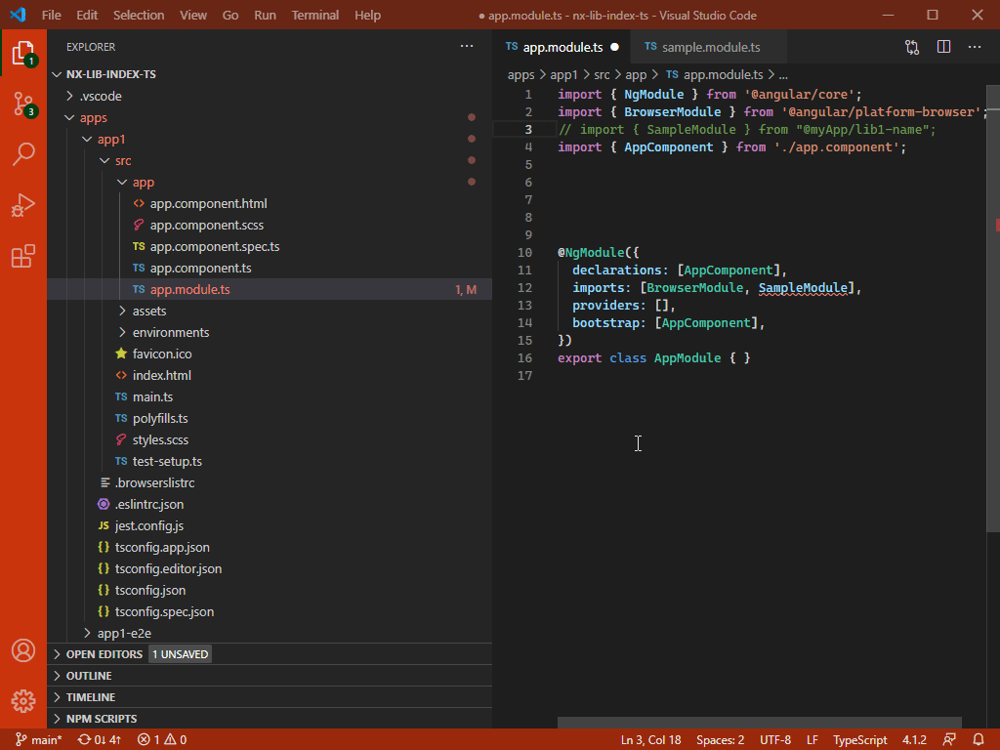

# steps to reproduce:

1- go to `apps\app1\src\app\app.module.ts`

2- try to import `SampleModule`

# Sytem Info 

> Version: 1.52.1 (user setup)  
> Commit: ea3859d4ba2f3e577a159bc91e3074c5d85c0523  
> Date: 2020-12-16T16:34:46.910Z  
> Electron: 9.3.5  
> Chrome: 83.0.4103.122  
> Node.js: 12.14.1  
> V8: 8.3.110.13-electron.0  
> OS: Windows_NT x64 10.0.19042  
