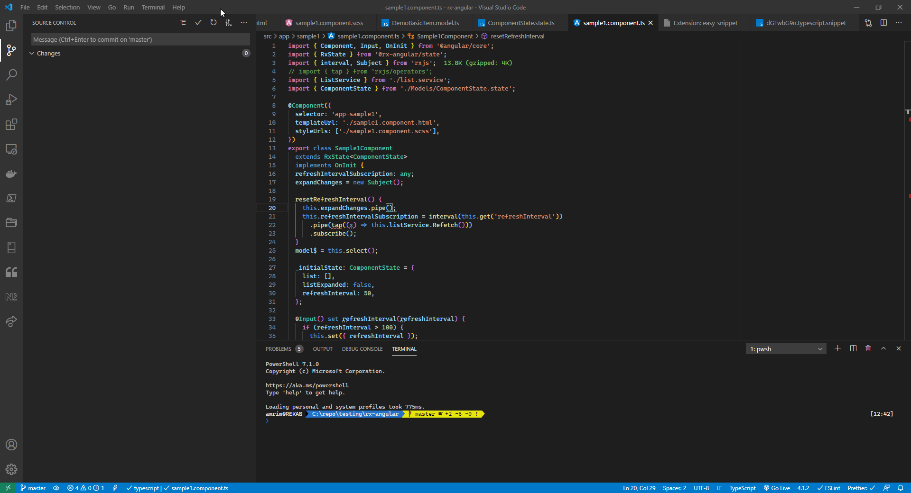

# steps to reporduce:

1- go to src\app\sample1\sample1.component.ts

2- play around with any operator from `rxjs/operators`

# system info

> Version: 1.52.1 (user setup)  
> Commit: ea3859d4ba2f3e577a159bc91e3074c5d85c0523  
> Date: 2020-12-16T16:34:46.910Z  
> Electron: 9.3.5  
> Chrome: 83.0.4103.122  
> Node.js: 12.14.1  
> V8: 8.3.110.13-electron.0  
> OS: Windows_NT x64 10.0.19042  

# Converted to

[angular repo](https://github.com/angular/angular/issues/40407)
[rxjs repo](https://github.com/ReactiveX/rxjs/issues/5950)
[typescript repo](https://github.com/microsoft/TypeScript/issues/42247)
